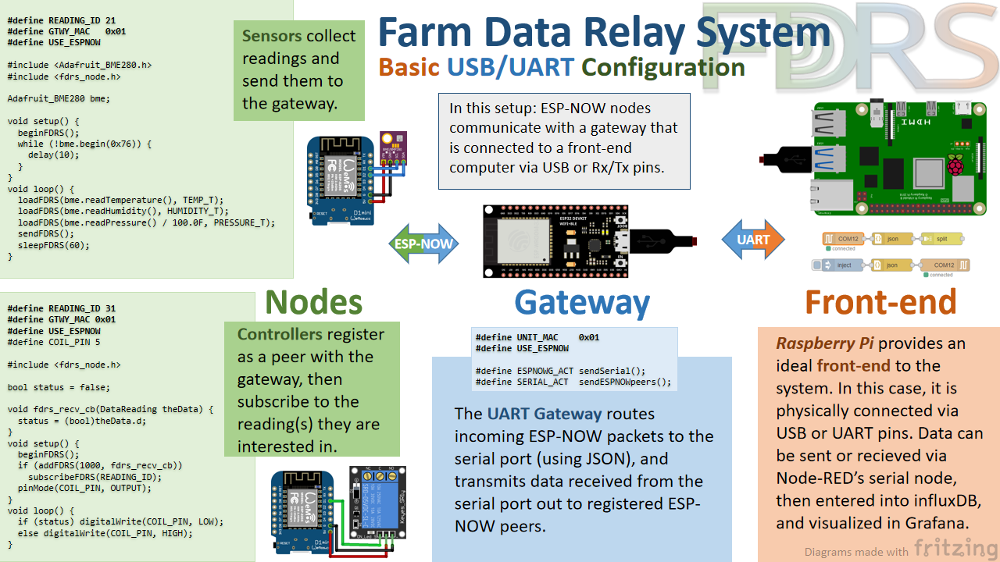
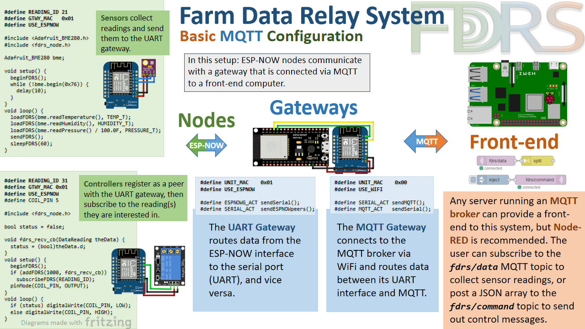

# 
Farm Data Relay System

##### 
[***In loving memory of Gay Holman, an extraordinary woman.***](https://www.facebook.com/CFECI/posts/2967989419953119) #####

Farm Data Relay System is an easy way to communicate with remote IoT devices without relying on WiFi or LoRaWAN infrastructure. It establishes a series of inexpensive, low-power access points and repeaters to provide ESP-NOW and LoRa coverage for remote devices. FDRS can be used to transport sensor readings and control messages in situations where it would be too cumbersome to provide full WiFi/LoRaWAN coverage. While the system was designed with farming in mind, FDRS could also be beneficial in a classroom, home, or research setting. 

Devices are classified into two types: **Gateways** and **Nodes**. Gateways comprise the infrastructure of the network, moving data along pre-directed routes and providing coverage to all devices. Nodes allow the user to exchange data with a gateway. Each gateway is identified with an 8-bit physical hex address (MAC), while nodes use 16-bit integers to identify datapoints as they move through the system.

## Getting Started
**Libraries Required:**
- [ArduinoJson](https://arduinojson.org/)
- [RadioLib](https://github.com/jgromes/RadioLib) for LoRa
- [PubSubClient](https://github.com/knolleary/pubsubclient/) for MQTT

**Included:**
- [ThingPulse OLED Library for ESP](https://github.com/ThingPulse/esp8266-oled-ssd1306)
#
**To install FDRS:**
1. Download or clone this repository and copy it into your Arduino **'libraries'** folder.

2.  After installing, edit the **'src/fdrs_globals.h'** file with your WiFi credentials and other global parameters.

3.  The first sketch you'll want to try is the **1_UART_Gateway.ino** example. This device will listen for incoming ESP-NOW packets, then route them to the serial port (and vice versa). Next, flash the **ESPNOW_Sensor.ino** example to see how to send data to the gateway.

4.  To use MQTT: Connect the second gateway to the first via the Rx and Tx pins (crossed), and flash it with the **0_MQTT_Gateway.ino** example. If your WiFi and MQTT configurations are correct, data will be published to the topic 'fdrs/data'.

5. To extend your range, try the **2_ESPNOW_Repeater.ino** or **3_LoRa_Repeater.ino**. Just change the *GTWY_MAC* of your sensor to the address of your new repeater.

## Nodes
**[Node Documentation](/extras/Node.md)**

Nodes can be described as *sensors, controllers, or both*:
- A **Sensor node** aggregates data into a packet, then sends it to a gateway via ESP-NOW or LoRa.
- A **Controller node** subscribes to one or more reading IDs. When data arrives from an ID the device is subscribed to, a callback function is called where the user can access the incoming data. 
  
## Gateways
**[Gateway Documentation](extras/Gateway.md)**
  
Gateways are modular and configurable microcontroller devices that can perform a variety of useful functions including collecting, distributing, and relaying wireless data. They provide a flexible and cohesive interface between various wired and wireless protocols, and are generally arranged in a line or star topology. As a general rule, the gateway that uses MQTT always has the address 0x00, and ESP-NOW and LoRa gateways start at 0x01.

In its most common usage, an FDRS gateway is deployed as an access point for remote ESP-NOW and LoRa user nodes. If it receives a packet from an unknown ESP-NOW or LoRa address, the gateway assumes that these are sensor readings and passes them downstream towards the front-end. The gateway will also broadcast packets coming *from* the front-end out to any controller nodes that are registered/listening. 

Gateways can also be configured as simple repeaters; passing data from one neighbor directly to another neighbor or vice versa. This can create a data wormhole that will carry packets upstream or downstream ad infinitum. You can configure your gateways to share data headed upstream with connected peers, thus providing them with any data being sent from the front-end.

If you're looking for a simple, attractve, and enclosed solution for your MQTT/UART gateway, I personally recommend both the **ThingPulse ESPGateway** and the **ThingPulse ESPGateway Ethernet**:

- The [ESPGateway](https://thingpulse.com/product/espgateway/) contains two ESP32 WROVER-IB Modules on one board with external antennas. They are linked together by pins 14 and 15 to allow for serial communication between them. This is the perfect setup for a link between ESP-NOW and WiFi.

- The [ESPGateway Ethernet](https://thingpulse.com/product/espgateway-ethernet-esp32-wifi-ble-gateway-with-rj45-ethernet-connector/) contains one ESP32 WROVER-IB Module with antenna, along with an RJ45 Ethernet connector. This is the hardware used in the ethernet gateway [example](https://github.com/timmbogner/Farm-Data-Relay-System/tree/main/examples/Gateway_Examples/1_MQTT_Gateway_Ethernet).
  
## Front-end
 The front-end is where all data is entered or consumed by another application. This could be anything from a microcontroller communicating through UART and displaying data on a screen to a server/database platform logging the data via MQTT.
 
My recommended method of accessing your data is using a computer, server, or Raspberry Pi linked to an FDRS Gateway device via either MQTT or UART. Node-RED is my favorite platform for accessing/manipulating data on the front-end, and InfluxDB+Grafana is the dream team for storage and visualization. 

## Future Plans
Upcoming goals for FDRS include:
- A method for FDRS gateways to keep track of the time via NTP or an RTC module, then seamlessly distribute it amongst its neighbors and connected nodes.
- More sensor and controller examples. If you are using a device or sensor that is not covered in the examples, feel free to contribute an example of its basic usage!
- Support for cellular radios with [TinyGSM](https://github.com/vshymanskyy/TinyGSM).
- Channel Activity Detection (CAD) for LoRa.
 
## Thank you
**...very much for checking out my project!** I truly appreciate everyone who has reached out with contributions and assistance, especially those featured in the "Contributors" section. If you have any questions, comments, issues, or suggestions please don't hesitate to contact me at timmbogner@gmail.com or open a discussion here on Github.

Many thanks go to the ever-instructional [**Andreas Spiess**](https://www.youtube.com/channel/UCu7_D0o48KbfhpEohoP7YSQ). His insight and ideas took this project from a roughly-hewn stone to the "[diamond](https://youtu.be/6JI5wZABWmA)" you see today. 

Thanks to [**LilyGo**](https://www.lilygo.cc/) for sending me new [LoRa32 modules](https://www.lilygo.cc/products/lora32-v1-0-lora-868mhz-915mhz) when mine were damaged. Much of this project was [created](https://github.com/timmbogner/Farm-Data-Relay-System/tree/main/examples/Sensor_Examples/LilyGo_HiGrow_32) using [TTGO devices](https://www.lilygo.cc/products/t-higrow), and I highly recommend their [products](https://www.lilygo.cc/products/lilygo%C2%AE-ttgo-t-display-1-14-inch-lcd-esp32-control-board)!

It is a great honor to have been [featured on **Hackaday**](https://hackaday.com/2022/07/02/farm-data-relay-system/) and [**hackster.io!**](https://www.hackster.io/news/timm-bogner-s-farm-data-relay-system-uses-esp8266-esp32-nodes-and-gateways-for-sensor-networks-b87a75c69f46)
  
I started this project with instructions from [**Random Nerd Tutorials**](https://randomnerdtutorials.com/). If you are a beginner and trying to learn more about microcontrollers, I highly recommend starting there.

 #

#
#

#
